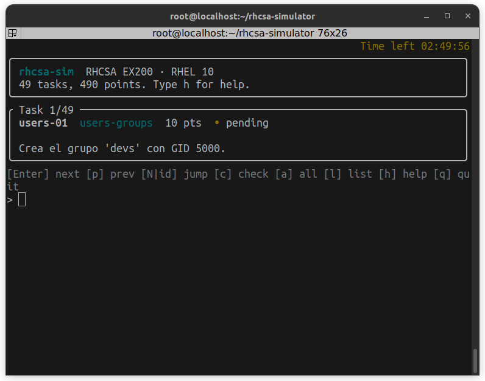

# rhcsa-sim

A practice checker for the **RHCSA exam (EX200, RHEL 10)**. You solve the tasks on a lab VM yourself, then `rhcsa-sim` inspects the **live system** and scores the result the way the exam does: a task scores only if all its checks pass, and 70% is a pass.

The checks never change the system, never run your scripts, and only use the Python standard library.

## Quick start

```bash
git clone git@github.com:xilen0x/rhcsa-simulator.git
cd rhcsa-simulator
python3 -m venv .venv
.venv/bin/pip install -e .

.venv/bin/rhcsa-sim list              # see every task
.venv/bin/rhcsa-sim show net-01       # read one task and its checks
sudo .venv/bin/rhcsa-sim check --all  # grade everything
sudo .venv/bin/rhcsa-sim              # interactive menu
```

Example output:

```text
[KO] net-02  Configura de forma persistente el hostname servera.lab.example.com.  (0/10)
     [KO] hostname is servera.lab.example.com: hostname is localhost.localdomain, expected servera.lab.example.com
```

> **Run checks with `sudo`.** Many checks read root-only state (LVM, firewalld, SELinux, sudoers, `/root`, other users' files, `grubby`, `atq`). Without root they fail with a hint telling you to use sudo, and the task does not score.

## Tested platforms

Developed and tested on **AlmaLinux 10.2**. It has **not been tested on RHEL 10 yet**. AlmaLinux is binary-compatible with RHEL, so the commands should behave the same, but some details may differ:

- Flatpak: AlmaLinux ships the `flathub` remote; RHEL may use a different remote, so `sw-01`/`sw-02` may need adjusting.
- Boot entry titles from `grubby` name the distribution (only the kernel arguments are graded).

If you run it on RHEL 10 or Rocky 10, please open an issue with what passed and what failed.

## Requirements

| What | Why |
|------|-----|
| AlmaLinux 10 (tested) or RHEL 10 / Rocky 10 (expected to work, not yet tested) | the tasks and commands target EX200 on RHEL 10 |
| Python 3.12+ | no runtime dependencies |
| A spare disk at `/dev/sdb` | storage tasks create partitions, LVM, swap and VFAT on it |
| Packages used by the checks: `acl`, `file`, `autofs`, `nfs-utils`, `flatpak`, `chrony`, `at` | a missing tool makes its checks fail, not crash |

Task text (descriptions) is in Spanish; command output is in English.

## Interactive menu

Run `rhcsa-sim` with no arguments (use `sudo` for the root-only checks) to open a menu that walks through the tasks one at a time:

| Key | Does |
|-----|------|
| `Enter` or `n` | next task |
| `p` | previous task |
| `<number>` or `<id>` | jump to a task (`3`, `net-01`) |
| `c` | grade the current task only |
| `a` | grade every task and print the total score |
| `l` | list every task with its status and the running score |
| `s` | show the current task again |
| `h` or `?` | help |
| `reset` | start a new 3-hour exam (restarts the timer) |
| `q` | quit |

The menu remembers what you graded during the session. `q`, `Ctrl+D` and `Ctrl+C` all exit with code `0`.

On a terminal, a 3-hour countdown is shown in the top-right corner. It keeps counting across reboots and reopening the menu: the exam start is stored in `/var/tmp/rhcsa-sim-exam.json`. Type `reset` (the full word) to start a new exam. Always run it with `sudo` (or always without) so the same user owns that file; otherwise the timer cannot be saved and a warning is shown.

### Screens

Each view replaces the previous one, and the command bar always stays at the bottom. On a terminal the timer is yellow and the status symbols are green and red.

Opening the menu (`sudo .venv/bin/rhcsa-sim`):



The same screen as text:

```text
                                                          Time left 02:41:07
╭──────────────────────────────────────────────────────────────────────────╮
│ rhcsa-sim  RHCSA EX200 · RHEL 10                                         │
│ 49 tasks, 490 points. Type h for help.                                   │
╰──────────────────────────────────────────────────────────────────────────╯
╭ Task 1/49 ───────────────────────────────────────────────────────────────╮
│ users-01  users-groups  10 pts  • pending                                │
│                                                                          │
│ Crea el grupo 'devs' con GID 5000.                                       │
╰──────────────────────────────────────────────────────────────────────────╯
[Enter] next [p] prev [N|id] jump [c] check [a] all [l] list [h] help [q] quit
>
```

Grading the current task with `c`:

```text
                                                          Time left 02:41:07
╭ Task 1/49 ───────────────────────────────────────────────────────────────╮
│ users-01  users-groups  10 pts  ✘ failed                                 │
│                                                                          │
│ Crea el grupo 'devs' con GID 5000.                                       │
╰──────────────────────────────────────────────────────────────────────────╯
✘ users-01  (0/10 pts)
   ✘ group devs exists with GID 5000: group 'devs' does not exist
[Enter] next [p] prev [N|id] jump [c] check [a] all [l] list [h] help [q] quit
>
```

Listing the tasks with `l` (`>` marks the current task; `✔` passed, `✘` failed, `•` not graded yet):

```text
                                                          Time left 02:41:07
   1 ✔  users-01     users-groups      10 pts
   2 ✔  users-02     users-groups      10 pts
>  3 ✘  users-03     users-groups      10 pts
   4 •  users-04     users-groups      10 pts
   5 •  users-05     users-groups      10 pts
  ...
  49 •  dep-03       deploy-maintain   10 pts
[█░░░░░░░░░░░░░░░░░░░] graded 3/49, score so far 20/490
[Enter] next [p] prev [N|id] jump [c] check [a] all [l] list [h] help [q] quit
>
```

## Commands

The subcommands below are kept for scripts and one-off checks.

| Command | Does |
|---------|------|
| `rhcsa-sim list` | lists task id, objective block, points and description |
| `rhcsa-sim show <id>` | shows one task and the checks that grade it |
| `rhcsa-sim check <id>` | grades one task |
| `rhcsa-sim check --all` | grades every task and prints the total score |

Exit codes: `0` every checked task passed, `1` at least one failed, `2` usage error or unknown task.

## Resetting the lab

The fastest and safest reset is a **VM snapshot**: take one before your first attempt and revert to it to start again from zero.

```bash
# libvirt / KVM, run on the host
virsh snapshot-create-as <vm> clean      # once, on the fresh VM
virsh snapshot-revert <vm> clean         # every time you want to start over
```

Without a snapshot, run the following as root (`sudo -i`) inside the VM. It undoes what the tasks ask for and leaves `/dev/sdb` empty.

> **Warning:** this deletes users, files, logical volumes and every partition on `/dev/sdb`. Run it only on a practice VM.

```bash
# Scheduled jobs (before deleting alice)
crontab -r -u alice 2>/dev/null
for job in $(atq | awk '$NF == "alice" {print $1}'); do atrm "$job"; done

# Users and groups
userdel -r alice; userdel -r bob; groupdel devs
sed -i 's/^PASS_MAX_DAYS.*/PASS_MAX_DAYS\t99999/' /etc/login.defs

# Mounts, autofs and /etc/fstab
systemctl disable --now autofs
rm -f /etc/auto.master.d/remote.autofs /etc/auto.remote
sed -i '\#^/remote[[:space:]]#d' /etc/auto.master
umount /data /mnt/vfat /mnt/nfs 2>/dev/null
swapoff /dev/sdb2 2>/dev/null
sdb2_uuid=$(blkid -s UUID -o value /dev/sdb2)
[ -n "$sdb2_uuid" ] && sed -i "/$sdb2_uuid/d" /etc/fstab
sed -i -E '\#[[:space:]]/(data|mnt/vfat|mnt/nfs)[[:space:]]#d' /etc/fstab
systemctl daemon-reload
rmdir /data /mnt/vfat /mnt/nfs /remote 2>/dev/null

# LVM and partitions on /dev/sdb
lvremove -y examvg/datalv; vgremove -y examvg; pvremove -y /dev/sdb1
wipefs -a /dev/sdb3 /dev/sdb2 /dev/sdb1 /dev/sdb
partprobe /dev/sdb

# Directories, SELinux and firewall
semanage fcontext -d '/srv/web(/.*)?'
rm -rf /srv/shared /srv/web
setsebool -P httpd_can_network_connect off
semanage port -d -t http_port_t -p tcp 82
firewall-cmd --permanent --zone=public --remove-service=http --remove-port=8080/tcp
firewall-cmd --reload

# Services, network and hostname
systemctl disable --now httpd
nmcli connection delete exam-static
hostnamectl hostname localhost.localdomain

# Software
cat > /etc/yum.repos.d/exam-internal.repo <<'EOF'
[exam-internal]
name=Exam Internal Repository
baseurl=http://repo.exam.local/internal/$basearch/os/
enabled=1
gpgcheck=0
skip_if_unavailable=False
EOF
flatpak uninstall --system -y org.gnome.TextEditor
dnf --disablerepo=exam-internal remove -y at
tuned-adm profile balanced

# Scripts and files under /root
rm -f /usr/local/bin/{sysinfo,etc-backup,check-users}.sh
rm -rf /root/backups
rm -f /root/{sysinfo.txt,services.bak,etc-backup.tar.gz,hosts-link,notes.txt,notes.hard,nologin.txt}
rm -f /root/.ssh/id_ed25519 /root/.ssh/id_ed25519.pub
ssh-keygen -R localhost

# Timer, chrony, boot arguments, crond nice, journald
systemctl disable --now backup.timer
rm -f /etc/systemd/system/backup.{service,timer}
systemctl daemon-reload
sed -i '/^server[[:space:]]\+classroom\.example\.com/d' /etc/chrony.conf
systemctl restart chronyd
grubby --update-kernel=ALL --remove-args=systemd.show_status=1
systemctl restart crond
```

A few things you named yourself, so remove them by hand:

| Task | Undo |
|------|------|
| `sec-01` | delete the `PermitRootLogin no` line you added (`grep -rn PermitRootLogin /etc/ssh/sshd_config /etc/ssh/sshd_config.d/`), then `systemctl reload sshd` |
| `sec-02` | delete your file in `/etc/sudoers.d/` (`grep -l alice /etc/sudoers.d/*`) |
| `log-01` | delete the drop-in that sets `Storage=persistent` in `/etc/systemd/journald.conf.d/`, then `systemctl restart systemd-journald`. Keep `/var/log/journal`: on AlmaLinux 10 the `systemd` package ships it |
| `dep-02` | put back the `server`/`pool` line you replaced in `/etc/chrony.conf` |
| `svc-02` | `systemctl set-default graphical.target` if the VM had a desktop before |

Things the script keeps on purpose: the local NFS export of `/srv/nfsexport` (a prerequisite for `fs-04`/`fs-05`, not a task), the `flathub` remote (AlmaLinux ships it) and SELinux in enforcing mode (the default). Reboot afterwards and run `sudo .venv/bin/rhcsa-sim check --all`: almost every task should now fail.

## What is covered

Tasks are grouped by the official EX200 RHEL 10 objective blocks:

| Block | Examples |
|-------|----------|
| Essential tools | tar + gzip archives, hard and soft links, saving `grep` output |
| Manage software | dnf repositories, packages, Flatpak remote and apps |
| Shell scripts | executable bash scripts with `if`, `for`, `$1`, `$(...)` (checked statically) |
| Operate running systems | nice values, persistent journal, tuned profile, copying files with `scp` |
| Local storage | GPT partitions, LVM volume group and logical volume, swap by UUID |
| File systems | XFS and VFAT mounts by UUID, NFS, autofs, ACLs, setgid directories |
| Deploy and maintain | services, default target, cron, `at`, systemd timers, chrony, `grubby` |
| Networking | static IPv4/IPv6 profiles, hostname, firewalld services and ports |
| Users and groups | users, groups, password aging, `login.defs` defaults |
| Security | SELinux modes, contexts, booleans and ports, sshd and sudo, umask, SSH keys |

Run `rhcsa-sim list` for the exact task list.

## Development

```bash
.venv/bin/pip install -e '.[dev]'
.venv/bin/pytest                # all tests (they never touch the real system)
.venv/bin/mypy src tests        # strict type check, must stay clean
```

Adding a task:

1. Add a check class in `src/rhcsa_sim/checks/` if no existing check fits. Checks are frozen dataclasses that receive a `CommandRunner` and return a `CheckResult`.
2. Declare the `Task` in `src/rhcsa_sim/catalog.py`.
3. Test it with `rhcsa_sim.testing.FakeCommandRunner`, using real command output captured on RHEL 10 or a compatible rebuild (AlmaLinux, Rocky) as fixtures.

`CLAUDE.md` describes the architecture and conventions in more detail.

## Contributing

Issues and pull requests are welcome. Before opening a PR:

- [ ] `.venv/bin/pytest` passes and `.venv/bin/mypy src tests` is clean.
- [ ] New checks are read-only and tested with `FakeCommandRunner`.
- [ ] Test fixtures come from real command output on RHEL 10 or a compatible rebuild; say which one, and say so if you could only derive them.
- [ ] New tasks map to an objective on the [official EX200 page](https://www.redhat.com/en/services/training/ex200-red-hat-certified-system-administrator-rhcsa-exam).

## License

[MIT](LICENSE).

## Disclaimer

This is an independent, unofficial study tool. It is not affiliated with, endorsed by or sponsored by Red Hat, Inc. Red Hat, RHEL, RHCSA and EX200 are trademarks or registered trademarks of Red Hat, Inc. The tasks are original practice exercises based on the public exam objectives; they are not real exam questions. Passing here does not guarantee passing the real exam.
